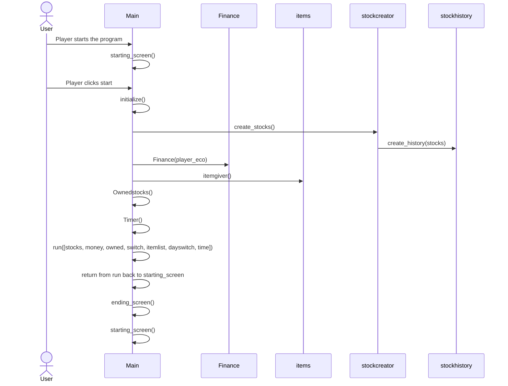

# Arkkitehtuurikuvaus

## Rakenne
Peli on jaoteltu useisiin kansioihin niiden tyypin perusteella. Ohjelmaa pyörittää tiedosto main.py, joka on suoraan src kansiossa.
- pakkaus src sisältää pelin tiedostot
  - inputs sisältää pelaajan hiiren liikkeitä ja inputteja tarkkailevan koodin, joka kutsuu/muokkaa sovelluslogiikan mukaisesti pelin asioita.
  - screen sisältää koodin, jolla piirretään käyttöliittymään pelin ruutu.
  - tools sisältää muutamia toistoa vähentäviä valmiita funktioita, joiden avulla voidaan piirtää pelin ruutuun asioita.
  - finance sisältää pelaajan rahatilannetta kuvaavan koodin.
  - shop sisältää pelin sisäisen kaupan logiikan.
 
 ## Käyttöliittymä
 
 Peli koostuu kolmesta eri päänäkymästä:
 - aloitusruutu
 - peliruutu
  - osake-finanssi näkymä
  - kauppa-finanssi näkymä
 - tiiviste ruutu, jossa pelin sisäisten päivien vaihtuessa kerrotaan pelaajalle tämän nettoarvo, eli onko osakkeista tullut voittoa
 - loppuruutu, jossa selvittyjen päivien määrä sekä ennätystaulu
 
 ## Sovelluslogiikka
 Sovellusta pyörittää tiedosto main.py, josta kutsutaan kuhunkin pelin tilanteeseen liittyvät funktio sekä käyttöliittymän kontrollointi sekä inputit.
 Peli lähtee käyntiin funktiolla start__screen, josta kutsutaan funktio intialize, josta alustetaan suurin osa pelissä tarvittavista rakeinteista, kuten osakkeet, kaupan sisältö, pelaajan taloudellinen tilanne sekä osake historia.
 
 ```mermaid
 classDiagram
      Main "*" --> "1" stockcreator
       Main "*" --> "1" Finance
        Main "*" --> "1" Items
      class Main{
          start_screen
          run
          Timer
          OwnedStocks
          initialize
      }
      class Items{
          Item
          itempool
          itemgiver
      }
      stockcreator "*" --> "1" stockhistory
      class Stockcreator{
          create_stocks
          
      }
      
      class Stockhistory{
          stock_operator
          create_history
          
      }
      
      class Finance{
          Finance
      }
      
      
```
## Päätoiminnallisuus
Kuvataan pelin toimintaa kolmella sekvenssi kaaviolla.
Pelin käynnistystä sekä alustamista kuvaa seuraava sekvenssi kaavio

Pelin pelinäkymää kuvaava sekvenssi kaavio


  ```mermaid
sequenceDiagram
  actor User
  participant Main
  participant Finance
  participant items
  participant stockcreator
  participant stockhistory
```

Pelin päivän vaihto

  ```mermaid
sequenceDiagram
  actor User
  participant Main
  participant Finance
  participant items
  participant stockcreator
  participant stockhistory
```
