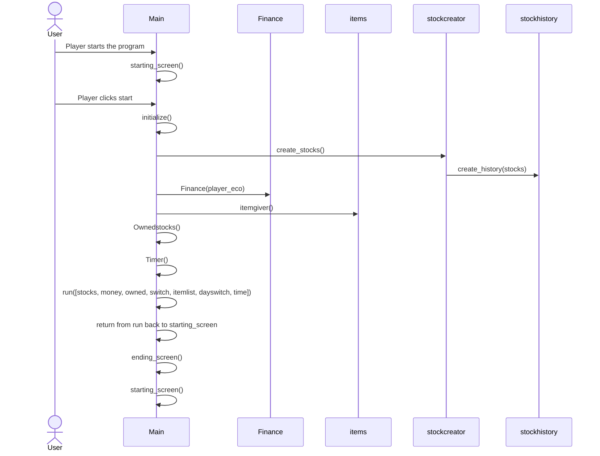

# Arkkitehtuurikuvaus

## Rakenne
Peli on jaoteltu useisiin kansioihin niiden tyypin perusteella. Ohjelmaa pyörittää tiedosto main.py, joka on suoraan src kansiossa.
- pakkaus src sisältää pelin tiedostot
  - inputs sisältää pelaajan hiiren liikkeitä ja inputteja tarkkailevan koodin, joka kutsuu/muokkaa sovelluslogiikan mukaisesti pelin asioita.
  - screen sisältää koodin, jolla piirretään käyttöliittymään pelin ruutu.
  - tools sisältää muutamia toistoa vähentäviä valmiita funktioita, joiden avulla voidaan piirtää pelin ruutuun asioita.
  - finance sisältää pelaajan rahatilannetta kuvaavan koodin.
  - shop sisältää pelin sisäisen kaupan logiikan.
 
 ## Käyttöliittymä
 
 Peli koostuu viidestä eri päänäkymästä:
 - aloitusruutu
 - hahmovalinta
 - peliruutu
    - osake-finanssi näkymä
    - kauppa-finanssi näkymä
    - tiiviste ruutu, jossa pelin sisäisten päivien vaihtuessa kerrotaan pelaajalle tämän nettoarvo, eli onko osakkeista tullut voittoa
 - nimen anto ruutu, jos pelaaja pääsi ennätyslista
 - loppuruutu, näkyy ennätys taulu sekä mahdollisuus pelata uudelleen tai lopettaa (quit)
 
 ## Sovelluslogiikka
 Sovellusta pyörittää tiedosto main.py, josta kutsutaan kuhunkin pelin tilanteeseen liittyvät funktio sekä käyttöliittymän kontrollointi sekä inputit.
 Peli lähtee käyntiin funktiolla start__screen, josta kutsutaan funktio intialize, josta alustetaan suurin osa pelissä tarvittavista rakeinteista, kuten osakkeet, kaupan sisältö, pelaajan taloudellinen tilanne sekä osake historia. Initialize myös huolehtii pelaajan hahmo valinnasta. Kun hahmo on valittu siirtyy sovellus funktioon run, joka pyörittää itse peli looppia. run funktiosta kutsutaan tarvittavat input funktiot sekä draw_screen komennot peli-tilan ylläpitämiseen. run funktiosta voidaan myös päivittää pelaajan raha tilanne sekä kaupa sisältämät tuotteet.
 
Kun ajastin loppuu tai pelaaja painaa end näppäintä, siirrytään day_change_op tiedostoihin, jotka vastaavat pelaajan nettoarvon laskemisesta sekä uuden päivän alustamisesta, eli tulojen lisäämisestä rahaan, menojen poistaminen rahoista sekä menojen korottaminen.

Jos pelaajalla ei ole käteisvarantoja maksaa kuluja tämä häviää pelin ja siirrytään ending_screen_op tiedostoihin, joissa käsitellään pelin jälkeiset toiminnot. Jos pelaaja on päässyt ennätys tauluun, kysytään tämän nimeä ja pelaajan annettua nimensä tulos talletetaan ennätystaulukkoon repositoriesin database_op avulla.
 
valittu hahmo vaikuttaaa pelaajan aloitusrahan määrään, tuloihin sekä menoihin. Myös yksi tärkeä elementti hahmolla on rerollprice, joka määrittelee miten tehokkaasti tämä voi hyödyntää kauppaa. Hahmon vaikeustasoon vaikuttaa myös menojen skaalautuminen, mikä ilmoitetaan hahmovalikossa.
 
monet sovelluksen erityisesti käyttöliittymän käyttämistä muuttujista tulee stats.py tiedostosta, joka lukee tarvitut tiedot config.txt tiedostosta. stats on (ainakin yritetty) turvattu try-except lausekkeilla, jotta peliin ei pääsisi vääriä pelin kaatavia arvoja. config.txt tiedoston kautta pystyy muuttamaan haluttuja pelin arvoja, kuten tekstin väriä tai yleistä väriteemaa tai fontteja.
 ### Luokkakaavio pelin korkean tason kansioiden suhteista
 ```mermaid
 classDiagram
      src "*" --> ui
       src "*" --> services
        src "*" --> repositories
        src "*" --> tests
         ui "*" --> draw_screen
         ui "*" --> inputs
         ui "*" --> tools
         Main "*" --> endinginit
         Main "*" --> endinginit
      class src{
          }
      class tests{
          }
      class ui{
          }
      class services{
          }
      class repositories{
          }
      class main.py{
          }
      class draw_screen{
          }
      class inputs{
          }
      class {
          }
      class main.py{
          }
      class main.py{
          }
     
      
      
```
 ### Luokkakaavio main.py:n suhteista
 ```mermaid
 classDiagram
      Main "*" --> "1" stockcreator
       Main "*" --> "1" Finance
        Main "*" --> "1" Items
         Main "*" --> "1" database_op
         Main "*" --> "1" endinginit
      class Main{
          start_screen
          run
          Timer
          OwnedStocks
          initialize
      }
      class Items{
          Item
          itempool
          itemgiver
      }
      stockcreator "*" --> "1" stockhistory
      class stockcreator{
          create_stocks
          
      }
      
      class stockhistory{
          stock_operator
          create_history
          
      }
      
      class Finance{
          Finance
      }
      
      
```
## Päätoiminnallisuus
Kuvataan pelin toimintaa neljällä sekvenssi kaaviolla.

## osa sekvenssikaavioista kaipaa päivitystä!!!

### Pelin käynnistystä sekä alustamista kuvaa seuraava sekvenssi kaavio

### Pelin pelinäkymää kuvaava sekvenssi kaavio

Tapahtumat pyörivät main.py tiedoston funktion run loopin sisällä nopeudella 10 tick/second.
Pelin peliloopin aikana ei juurikaan tapahdu muita pelilogiikan kannalta oleellisia asioita kuin rahatilanteen ylläpito ja omistettujen osakkeiden määrät sekä ostettujen asioiden aiheuttamien muutosten asettaminen voimaan. Suurin osa komennoista koostuu pelaajan syötteen lukemisesta sekä käyttöliittymän päivittämisestä niiden perusteella. kaikki kommunikointi käyttäjän ja ohjelman välillä tapahtuu hiirellä helpon käyttäjäkokemuksen luomiseksi.

  ```mermaid
sequenceDiagram
  actor User
  participant Main
  participant effects
  participant items
  participant draw_screen
  participant inputs
  participant (tools)
  Main->>draw_screen: drawinfo(wholefinance, timedifference, timer, screen)
  Main->>inputs: inputters(owned, stocks, wholefinance, shopswitch, dayswitch)
  Main->>draw_screen: drawstocks(stocks, screen)
  Main->>draw_screen: drawowned(owned, screen)
  draw_screen->>(tools): certain unique pygame commands are used to draw needed elements on screen
  User->>inputs: Player leftclicks on a stock, finance.money-stock.price
  User->>inputs: Player rightclicks on a stock, finance.money+stock.price
  User->>inputs: Player leftclicks on market-> shopswitch.take=True
  Main->>draw_screen: blank() (cleans the screen to evade drawn objects overlapping
  Main->>inputs: inputterm(shopswitch, itemlist, wholefinance, dayswitch)
  Main->>draw_screen: drawshop(itemlist, screen)
  User->>inputs: User leftclicks on an item
  inputs->>effects: apply_effect(effects, financeinfo)
  User->>inputs: User clicks on end to end the current day -> dayswitch.take=True
  Main->>draw_screen: wholeblank(screen)
```
seuraavaksi tapahtuu pelin sisäisen päivän vaihto ja siihen liittyvät toimenpiteet. Jos pelaajan käteisvarat eivät kuitenkaan riitä menoihin, peli siirtyy päivänvaihdon sijaan lopetusruutuun.

### Pelin päivän vaihto

  ```mermaid
sequenceDiagram
  actor User
  participant inputs
  participant Main
  participant daychange
  participant day_change_operator
  participant Finance
  participant items
  participant stockhistory
  participant draw_screen
  Main->>daychange: daychange(stocks, wholefinance, owned, timer)
  daychange->>items: itemgiver()
  daychange->>stockhistory: stock_update(stocks)
  stockhistory->>stockhistory: stock_operator(stock)
  daychange->>day_change_operator: finance_update(finance, timer)
  daychange->>day_change_operator: summary(stocks, finance, owned)
  daychange->>Main: return summary, itemlist and stocks
  Main->>daychange: summary_driver(screen, summary, wholefinance, summaryloop)
  daychange->>draw_screen: draw_summary(screen, summary, finance)
  daychange->>inputs: summaryinput(summaryloop)
  User->>inputs: Player clicks on "okey" button and a new day begins and timer resets
  Main->>draw_screen: wholeblank() clears whole screen
```

### lopetus ruutu ja ennätyslista

  ```mermaid
sequenceDiagram
  actor User
  participant endinputs
  participant main
  participant Finance
  participant items
  participant stockhistory
  participant draw_ending
  participant database_op
  participant endinginit
  main->>main: ending_screen(days)
  main->>database_op: database=Databaseop()
  database_op->>database_op: self.exist()
  database_op->>database_op: self.geths()
  main->>endinit: need_new_name(days. database) (in this case player made it to highscoretable and name is needed)
  main->>draw_ending: draw_name_need(database. screen)
  main->>endinputs: nameinputs(database. needname. cursorposition)
  User->>endinputs: player types their name and pressses enter ending loop
  main->>draw_ending: draw_hs(database. screen) draw highscorelist
  main->>endinputs: nextinputs()
  User->>endinputs: player presses play again
  main->>main: back to starting screen loop
```

