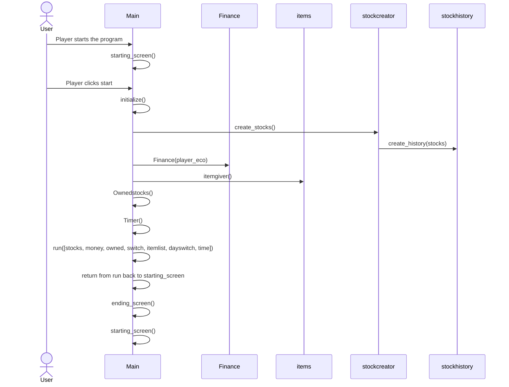

# Arkkitehtuurikuvaus

## Rakenne
Peli on jaoteltu useisiin kansioihin niiden tyypin perusteella. Ohjelmaa pyörittää tiedosto main.py, joka on suoraan src kansiossa.
- pakkaus src sisältää pelin tiedostot
  - inputs sisältää pelaajan hiiren liikkeitä ja inputteja tarkkailevan koodin, joka kutsuu/muokkaa sovelluslogiikan mukaisesti pelin asioita.
  - screen sisältää koodin, jolla piirretään käyttöliittymään pelin ruutu.
  - tools sisältää muutamia toistoa vähentäviä valmiita funktioita, joiden avulla voidaan piirtää pelin ruutuun asioita.
  - finance sisältää pelaajan rahatilannetta kuvaavan koodin.
  - shop sisältää pelin sisäisen kaupan logiikan.
 
 ## Käyttöliittymä
 
 Peli koostuu kolmesta eri päänäkymästä:
 - aloitusruutu
 - peliruutu
  - osake-finanssi näkymä
  - kauppa-finanssi näkymä
 - tiiviste ruutu, jossa pelin sisäisten päivien vaihtuessa kerrotaan pelaajalle tämän nettoarvo, eli onko osakkeista tullut voittoa
 - loppuruutu, jossa selvittyjen päivien määrä sekä ennätystaulu
 
 ## Sovelluslogiikka
 Sovellusta pyörittää tiedosto main.py, josta kutsutaan kuhunkin pelin tilanteeseen liittyvät funktio sekä käyttöliittymän kontrollointi sekä inputit.
 Peli lähtee käyntiin funktiolla start__screen, josta kutsutaan funktio intialize, josta alustetaan suurin osa pelissä tarvittavista rakeinteista, kuten osakkeet, kaupan sisältö, pelaajan taloudellinen tilanne sekä osake historia.
 
 ```mermaid
 classDiagram
      Main "*" --> "1" stockcreator
       Main "*" --> "1" Finance
        Main "*" --> "1" Items
      class Main{
          start_screen
          run
          Timer
          OwnedStocks
          initialize
      }
      class Items{
          Item
          itempool
          itemgiver
      }
      stockcreator "*" --> "1" stockhistory
      class Stockcreator{
          create_stocks
          
      }
      
      class Stockhistory{
          stock_operator
          create_history
          
      }
      
      class Finance{
          Finance
      }
      
      
```
## Päätoiminnallisuus
Kuvataan pelin toimintaa kolmella sekvenssi kaaviolla.

### Pelin käynnistystä sekä alustamista kuvaa seuraava sekvenssi kaavio

### Pelin pelinäkymää kuvaava sekvenssi kaavio

Tapahtumat pyörivät main.py tiedoston funktion run loopin sisällä nopeudella 10 tick/second.
Pelin peliloopin aikana ei juurikaan tapahdu muita pelilogiikan kannalta oleellisia asioita kuin rahatilanteen ylläpito ja omistettujen osakkeiden määrät sekä ostettujen asioiden aiheuttamien muutosten asettaminen voimaan. Suurin osa komennoista koostuu pelaajan syötteen lukemisesta sekä käyttöliittymän päivittämisestä niiden perusteella. kaikki kommunikointi käyttäjän ja ohjelman välillä tapahtuu helpomman käyttäjäkokemuksen luomiseksi.

  ```mermaid
sequenceDiagram
  actor User
  participant Main
  participant effects
  participant items
  participant draw_screen
  participant inputs
  participant (tools)
  Main->>draw_screen: drawinfo(wholefinance, timedifference, timer, screen)
  Main->>inputs: inputters(owned, stocks, wholefinance, shopswitch, dayswitch)
  Main->>draw_screen: drawstocks(stocks, screen)
  Main->>draw_screen: drawowned(owned, screen)
  draw_screen->>(tools): certain unique pygame commands are used to draw needed elements on screen
  User->>inputs: Player leftclicks on a stock, finance.money-stock.price
  User->>inputs: Player rightclicks on a stock, finance.money+stock.price
  User->>inputs: Player leftclicks on market-> shopswitch.take=True
  Main->>draw_screen: blank() (cleans the screen to evade drawn objects overlapping
  Main->>inputs: inputterm(shopswitch, itemlist, wholefinance, dayswitch)
  Main->>draw_screen: drawshop(itemlist, screen)
  User->>inputs: User leftclicks on an item
  inputs->>effects: apply_effect(effects, financeinfo)
  User->>inputs: User clicks on end to end the current day -> dayswitch.take=True
  Main->>draw_screen: wholeblank(screen)
```
seuraavaksi tapahtuu pelin sisäisen päivän vaihto ja siihen liittyvät toimenpiteet. Jos pelaajan käteisvarat eivät kuitenkaan riitä menoihin, peli siirtyy päivänvaihdon sijaan lopetusruutuun.

### Pelin päivän vaihto

  ```mermaid
sequenceDiagram
  actor User
  participant Main
  participant daychange
  participant day_change_operator
  participant Finance
  participant items
  participant stockhistory
  participant draw_screen
  participant inputs
  Main->>daychange: daychange(stocks, wholefinance, owned, timer)
  daychange->>items: itemgiver()
  daychange->>stockhistory: stock_update(stocks)
  stockhistory->>stockhistory: stock_operator(stock)
  daychange->>day_change_operator: finance_update(finance, timer)
  daychange->>day_change_operator: summary(stocks, finance, owned)
  daychange->>Main: return summary, itemlist and stocks
  Main->>daychange: summary_driver(screen, summary, wholefinance, summaryloop)
  daychange->>draw_screen: draw_summary(screen, summary, finance)
  daychange->>inputs: summaryinput(summaryloop)
  User->>inputs: Player clicks on "okey" button and a new day begins and timer resets
  Main->>draw_screen: wholeblank() clears whole screen
```
